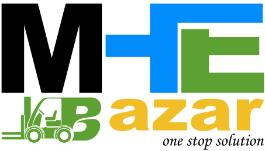

## About Project

The website [MHE Bazar](https://www.mhebazar.in/) is a leading online platform that specializes in providing a comprehensive range of material handling equipment solutions. As a one-stop destination for all material handling needs, MHE Bazar offers a wide variety of products and services designed to cater to diverse industries and applications.

Some of the key features of MHE Bazar include:

- **Product Offerings**: MHE Bazar provides an extensive range of material handling equipment, offering customers the opportunity to choose from a variety of options to meet their specific needs.
- **Global Delivery**: MHE Bazar delivers products worldwide, ensuring that customers from all corners of the globe can access their high-quality material handling solutions.
- **Expert Training**: MHE Bazar offers expert training in material handling equipment, providing customers with the knowledge and skills necessary to operate and maintain their equipment effectively.
- **About Us**: MHE Bazar is committed to providing complete material handling solutions, ensuring that customers receive the best possible service and support.

For more information about MHE Bazar and their material handling equipment offerings, you can visit their website at [mhebazar.in](https://www.mhebazar.in/).

Citations:
[1] https://www.mhebazar.in
[2] https://www.globallinker.com/network/tools-machinery-components/mhe-bazar-391328
[3] https://www.mhebazar.in/training
[4] https://www.mhebazar.in/about-us

https://github.com/princeidot/mhebazar/assets/131530732/75c76802-c532-46ed-af39-64718960d2b6

## Admin Panel

The admin panel of MHE Bazar offers a comprehensive interface that allows users to visualize form data in date-wise graphs, providing insights into trends and patterns over time. Users can generate monthly reports to track key metrics and performance indicators effectively. Additionally, the admin panel displays the number of users categorized as vendors and regular users, following a concept similar to OLX.

Key features of the admin panel include:
- **Graphical Representation**: Visual representation of form data in date-wise graphs for easy analysis.
- **User Segmentation**: Identification of users as vendors or regular users for targeted management.
- **Product Management**: Ability to edit, approve, or disapprove user products directly from the admin panel.
- **Data Export**: Option to export data in Excel format for further analysis and reporting.
- **User Management**: Capability to add sub-admins and manage multiple user accounts efficiently.

This admin panel enhances the functionality of MHE Bazar by providing administrators with tools to monitor and optimize user interactions, product listings, and overall platform performance.

For more information about MHE Bazar and their material handling equipment solutions, you can visit their website at [mhebazar.in](https://www.mhebazar.in/).

